# 🏥 HealthQAGenAgent

<div align="center">


**AI-Driven Healthcare Software Test Case Generation Platform**

*Revolutionizing healthcare software testing with compliance-first, audit-proof QA automation*

</div>

---

## 🚀 Elevator Pitch

**HealthQAGenAgent** is a cutting-edge AI-powered platform that transforms healthcare software testing by automatically generating, executing, and validating comprehensive test cases for healthcare applications. Built with compliance at its core, our multi-agent system ensures thorough coverage of critical healthcare workflows while maintaining strict adherence to healthcare regulations like HIPAA, HL7 FHIR, and FDA guidelines. By leveraging Google Cloud's Vertex AI and a sophisticated agent mesh architecture, HealthQAGenAgent eliminates manual testing bottlenecks, reduces compliance risks, and accelerates time-to-market for healthcare software products.

---

## ✨ Features at a Glance

| Feature | Description |
|---------|-------------|
| 📊 **Smart Dashboard** | Real-time analytics, KPI tracking, and compliance metrics visualization |
| ⚙️ **Intelligent Test Generation** | AI-powered test case creation from FHIR data and code analysis |
| 💬 **Conversational Interface** | Natural language queries for test insights and compliance guidance |
| 🔍 **FHIR Explorer** | Interactive healthcare data exploration and validation tools |
| ✅ **Advanced Test Results** | Comprehensive reporting with filtering, export, and audit trails |
| ⚡ **Flexible Configuration** | Customizable settings for different healthcare environments |

---

## 🏗️ System Architecture


---

## 🔄 User Journey Flow

```mermaid
flowchart LR
    A[📁 Upload Dataset] --> B[⚙️ Generate Tests]
    B --> C[📊 View Dashboard]
    C --> D[💬 Ask AI Questions]
    D --> E[🔍 Explore FHIR Data]
    E --> F[✅ Review Results]
    F --> G[⚡ Configure Settings]
    G --> H[📋 Export Reports]
    
    style A fill:#e1f5fe
    style B fill:#f3e5f5
    style C fill:#e8f5e8
    style D fill:#fff3e0
    style E fill:#fce4ec
    style F fill:#e0f2f1
    style G fill:#f1f8e9
    style H fill:#e3f2fd
```



---

## 🛠️ Tech Stack

<div align="center">

| Frontend | Backend | Cloud & AI | Data & Storage |
|----------|---------|------------|----------------|
|  |  |  |  |
|  |  |  |  |
|  |  |  |  |

</div>

---

## 🚀 Getting Started

### Prerequisites
- Node.js 20+
- Python 3.9+
- Google Cloud SDK
- Docker (optional)

### Quick Start

1. **Clone the Repository**
   ```bash
   git clone https://github.com/yourusername/HealthQaGenAgent.git
   cd HealthQaGenAgent
   ```

2. **Install Dependencies**
   ```bash
   # Frontend
   cd frontend
   npm install
   
   # Backend Functions
   cd ../functions
   npm install
   
   # Python Services
   cd ../
   pip install -r requirements.txt
   ```

3. **Environment Setup**
   ```bash
   cp .env.example .env
   # Edit .env with your configuration
   ```

4. **Run Locally**
   ```bash
   # Start frontend with mock API
   cd frontend
   npm run dev
   
   # Access at http://localhost:5173
   ```

5. **Deploy to Cloud**
   ```bash
   # Build and deploy
   npm run build
   firebase deploy
   ```

### 🔧 Configuration

Set up your environment variables:
```env
GOOGLE_CLOUD_PROJECT=your-project-id
GEMINI_API_KEY=your-gemini-key
FHIR_ENDPOINT=your-fhir-server
```

---

## 🎥 Demo Video & Screenshots

### 📹 Demo Video
[](https://www.youtube.com/watch?v=YOUR_VIDEO_ID)

### 📸 Screenshots

<div align="center">

| Dashboard | Test Generation |
|-----------|-----------------|
|  |  |

| FHIR Explorer | Conversational AI |
|---------------|-------------------|
|  |  |

</div>

---

## 🗺️ Roadmap

### ✅ Completed Features
- [x] Multi-agent architecture with specialized healthcare agents
- [x] FHIR data ingestion and validation
- [x] AI-powered test case generation
- [x] Interactive dashboard with real-time analytics
- [x] Conversational AI interface with Gemini integration
- [x] FHIR resource explorer with JSON viewer
- [x] Advanced test result filtering and export
- [x] Dark/light theme support
- [x] Comprehensive fallback system for demos

### 🚧 In Progress
- [ ] Advanced compliance reporting (HIPAA, SOC 2)
- [ ] Integration with popular CI/CD pipelines
- [ ] Multi-tenant architecture for enterprise

### 🔮 Planned Features
- [ ] Real-time collaborative testing environments
- [ ] Advanced ML models for predictive test failure analysis
- [ ] Integration with Epic, Cerner, and other EHR systems
- [ ] Automated security vulnerability scanning
- [ ] Performance testing and load simulation
- [ ] Mobile app for on-the-go test monitoring
- [ ] Blockchain-based audit trail for regulatory compliance

---

## 🤝 Contributing

We welcome contributions from the healthcare and software testing community!

### How to Contribute
1. Fork the repository
2. Create a feature branch (`git checkout -b feature/amazing-feature`)
3. Commit your changes (`git commit -m 'Add amazing feature'`)
4. Push to the branch (`git push origin feature/amazing-feature`)
5. Open a Pull Request

### Development Guidelines
- Follow PEP 8 for Python code
- Use TypeScript for all new frontend code
- Write comprehensive tests for new features
- Update documentation for API changes
- Ensure HIPAA compliance in all healthcare data handling

### Code of Conduct
Please read our [Code of Conduct](CODE_OF_CONDUCT.md) before contributing.

---

## 📄 License

This project is licensed under the MIT License - see the [LICENSE](LICENSE) file for details.


---

<div align="center">

**⚡ Powered by AI • 🛡️ Compliance-First • 🚀 Cloud-Native**

*Transforming Healthcare Software Testing, One Test Case at a Time*

</div>