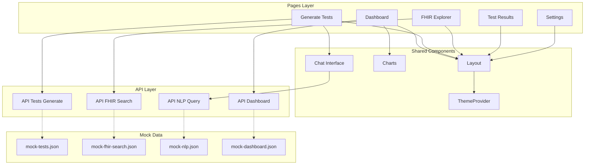

# ⚛️ HealthQAGenAgent Frontend

<div align="center">


**Frontend for HealthQAGenAgent – a compliance-first QA platform for healthcare**

</div>

---

## 🏧 Frontend Architecture



---

## ✨ Features

| Feature | Description |
|---------|-------------|
| 📊 **Interactive Dashboard** | Real-time charts, KPIs, and healthcare metrics visualization |
| ⚙️ **Test Generation** | File upload, AI-powered test case creation, and results display |
| 💬 **Conversational AI** | Natural language queries with chat interface and AI responses |
| 🔍 **FHIR Explorer** | Search healthcare resources, view JSON details, and data validation |
| ✅ **Advanced Results** | Filtering, sorting, CSV export, and comprehensive test reporting |
| 🌗 **Dark/Light Mode** | Global theme switching with persistent user preferences |
| 🔄 **Fallback System** | Automatic mock data loading when APIs are unavailable |

---

## 🛠️ Tech Stack

| Category | Technology | Version |
|----------|------------|----------|
| **Framework** | React | 18.2.0 |
| **Language** | TypeScript | 5.0 |
| **Styling** | Tailwind CSS | 3.0 |
| **Charts** | Chart.js + React-Chartjs-2 | 4.4.0 |
| **Icons** | Heroicons | 2.0 |
| **Build Tool** | Vite | 5.0 |
| **HTTP Client** | Fetch API | Native |
| **Routing** | React Router | 6.14 |

---

## 🚀 Setup & Run

### Prerequisites
- Node.js 20+
- npm or yarn

### Installation

```bash
# Clone and navigate to frontend
cd frontend

# Install dependencies
npm install

# Start development server
npm run dev

# Access at http://localhost:5173
```

### Environment Variables

Create a `.env` file in the frontend directory:

```env
# Optional - for production API endpoints
VITE_API_BASE_URL=https://your-api-endpoint.com
VITE_GEMINI_API_KEY=your-gemini-key

# Development - uses mock data by default
VITE_USE_MOCK_DATA=true
```

### Build for Production

```bash
# Build optimized bundle
npm run build

# Preview production build
npm run preview
```

---

## 📊 Mock Data System

The frontend includes comprehensive mock data for demo purposes:

| File | Purpose | API Fallback |
|------|---------|-------------|
| `mock-tests.json` | Test case generation results | `/api/tests/generate` |
| `mock-fhir-search.json` | FHIR resource search results | `/api/fhir/search` |
| `mock-nlp.json` | AI conversational responses | `/api/nlp/query` |
| `mock-dashboard.json` | Dashboard metrics and charts | `/api/dashboard` |
| `mock-test-results.json` | Detailed test result data | `/api/tests/results` |

### How Fallbacks Work

1. **API Call**: Frontend attempts real API call with 3-6s timeout
2. **Fallback Trigger**: On timeout, network error, or 4xx/5xx response
3. **Mock Loading**: Automatically loads corresponding JSON file
4. **User Notification**: Shows "Using demo data" toast message
5. **Seamless UX**: No blank screens or infinite spinners

---

## 📝 Development Guidelines

### Folder Structure

```
src/
├── components/          # Shared UI components
├── contexts/           # React contexts (Theme, etc.)
├── pages/              # Page components
├── api/                # API client functions
├── styles/             # Global styles
└── App.tsx             # Main app component
```

### Code Standards

- **TypeScript**: All new code must use TypeScript
- **Components**: Use functional components with hooks
- **Styling**: Tailwind CSS utility classes preferred
- **State**: React hooks for local state, Context for global state
- **API**: Centralized in `api/client.ts` with error handling

### Commit Message Format

```
type(scope): description

feat(dashboard): add real-time chart updates
fix(api): handle timeout errors gracefully
docs(readme): update setup instructions
```

### Linting & Formatting

```bash
# Run TypeScript checks
npm run type-check

# Format code (if configured)
npm run format
```


---

## 🔧 Local Testing

### With Mock Data (Recommended for Demo)

```bash
cd frontend
npm run dev
# All APIs automatically use mock data
```

### With Firebase Emulator

```bash
# Terminal 1: Start mock API server
node mock-server.js

# Terminal 2: Start frontend
npm run dev

# Access at http://localhost:5173
```

### Verification Checklist

- ✅ Dashboard loads with charts and KPIs
- ✅ Generate Tests accepts file upload and shows results
- ✅ Conversational interface responds to queries
- ✅ FHIR Explorer searches and displays resources
- ✅ Test Results filters and exports CSV
- ✅ Settings toggles theme and saves preferences
- ✅ Dark/Light mode works across all pages

---

<div align="center">

**⚡ Built with React • 🎨 Styled with Tailwind • 📊 Powered by Chart.js**

*Healthcare-focused frontend for compliance-first QA automation*

</div>
